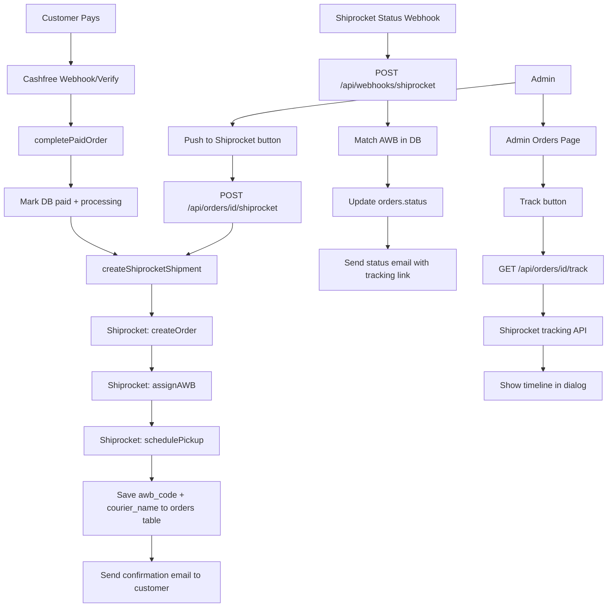

# Shiprocket Integration Plan

## Part 1 — Before Writing Any Code (Shiprocket Account Setup)

### Documents / Steps Required in Shiprocket Dashboard

1. **Sign up** at [app.shiprocket.in](https://app.shiprocket.in) using the business email.
2. **KYC Verification** — upload:
   - GST certificate (or GSTIN number — mandatory for businesses)
   - PAN card (proprietor or company)
   - Aadhaar card (proprietor/director)
   - Business bank account details (for COD remittance — fill under Settings → Bank Details)
3. **Pickup Address** — Settings → Manage Pickup Addresses → Add Warehouse:
   - Name: `Gifwoods Warehouse` (this name goes in the API as `pickup_location`)
   - Full address, pincode, contact person, phone
   - This address is used on every shipment label; must be verified by Shiprocket
4. **Courier Partners** — Settings → Courier Partners → Activate recommended couriers (Delhivery, DTDC, Blue Dart, etc.). Shiprocket auto-selects cheapest/fastest per shipment.
5. **API Credentials** — Settings → API → generate API email/password (same as login, but note it — the token endpoint requires email + password).
6. **Webhook URL** — Settings → API → Webhooks → add `https://gifwoods.com/api/webhooks/shiprocket` for shipment status events.

---

## Part 2 — Database Changes

### New migration: `20260829000000_add_shiprocket_fields.sql`

Add to the `orders` table:

```sql
ALTER TABLE orders
  ADD COLUMN IF NOT EXISTS shiprocket_order_id TEXT,
  ADD COLUMN IF NOT EXISTS shiprocket_shipment_id TEXT,
  ADD COLUMN IF NOT EXISTS awb_code TEXT,
  ADD COLUMN IF NOT EXISTS courier_name TEXT,
  ADD COLUMN IF NOT EXISTS tracking_url TEXT;
```

---

## Part 3 — Backend Architecture

### 3.1 Shiprocket API Client — `src/lib/shiprocket/client.ts`

Handles:

- `getToken()` — POST `/auth/login`, caches token in memory (valid 24 h)
- `createOrder(payload)` — POST `/orders/create/adhoc`
- `assignAWB(shipmentId)` — POST `/courier/assign/awb`
- `schedulePickup(shipmentId)` — POST `/courier/generate/pickup`
- `getTracking(awb)` — GET `/courier/track/awb/{awb}`
- `cancelOrder(shiprocketOrderId)` — POST `/orders/cancel`

Base URL from env: `SHIPROCKET_BASE_URL=https://apiv2.shiprocket.in/v1/external`

Types file: `src/types/shiprocket.ts` — `ShiprocketOrderPayload`, `ShiprocketOrderResponse`, `ShiprocketTrackingResponse`.

### 3.2 Auto-create shipment after payment

In [`src/lib/orders/complete-payment.ts`](src/lib/orders/complete-payment.ts), after the Supabase update succeeds, call a new `createShiprocketShipment(order)` helper. This:

1. Calls `createOrder()` → gets `shiprocket_order_id` and `shipment_id`
2. Calls `assignAWB(shipment_id)` → gets `awb_code` and `courier_name`
3. Calls `schedulePickup(shipment_id)` → schedules pickup
4. Updates the `orders` row with `shiprocket_order_id`, `shiprocket_shipment_id`, `awb_code`, `courier_name`, `tracking_url`

Wrap in try/catch — failure logs but does NOT block payment confirmation.

### 3.3 Webhook receiver — `src/app/api/webhooks/shiprocket/route.ts`

- Accepts POST from Shiprocket on status changes (picked up / in-transit / delivered / RTO)
- Validates by matching `awb_code` against our DB
- Updates `orders.status` accordingly (`shipped` when picked up, `delivered` on delivery)
- Triggers the existing status email

### 3.4 Admin tracking endpoint — `src/app/api/orders/[id]/track/route.ts`

GET route that fetches live tracking from Shiprocket via `getTracking(awb)` and returns it to the admin client.

### 3.5 Manual push (for re-try) — part of `PATCH /api/orders/[id]`

Add an action `"push_to_shiprocket"` that admins can trigger if auto-create failed.

---

## Part 4 — UI Changes

### 4.1 Admin Orders Table — `AdminOrdersClient.tsx`

- Add a new "Shipment" column showing:
  - AWB code (if present)
  - Courier name badge
- Add a "Track" button that opens a dialog with live tracking events from `/api/orders/[id]/track`
- Add a "Push to Shiprocket" button (shown only if `shiprocket_order_id` is missing) to manually trigger shipment creation

### 4.2 Admin Order Detail / Status Dialog

In the status update dialog, when admin sets status to `shipped`, auto-show the AWB if present.

### 4.3 Customer Order Detail Page — `src/app/(public)/orders/[id]/page.tsx`

When `awb_code` is present, show a tracking section:

```
Tracking  ·  Courier: Delhivery  ·  AWB: 123456789
[Track your order →]   (opens courier tracking link or Shiprocket tracking page)
```

Show only when order status is `processing`, `shipped`, or `delivered`.

### 4.4 Shipped Email Update — `src/lib/email/templates/order-email.ts`

When status is `shipped` and `tracking_url` exists, append:

> "Track your shipment: [link]"

---

## Part 5 — Order Type Update — `src/types/order.ts`

Add to the `Order` interface:

```typescript
shiprocket_order_id?: string | null;
shiprocket_shipment_id?: string | null;
awb_code?: string | null;
courier_name?: string | null;
tracking_url?: string | null;
```

---

## Part 6 — Environment Variables

Add to `.env.local`, `.env.example`, and Vercel:

```env
SHIPROCKET_EMAIL=your-shiprocket-email
SHIPROCKET_PASSWORD=your-shiprocket-password
SHIPROCKET_PICKUP_LOCATION=Gifwoods Warehouse
SHIPROCKET_BASE_URL=https://apiv2.shiprocket.in/v1/external
```

---

## Part 7 — Full Flow Diagram



---

## Part 8 — Summary of Changes by File

- **New files:**
  - `src/lib/shiprocket/client.ts` — API client
  - `src/types/shiprocket.ts` — TypeScript types
  - `src/app/api/webhooks/shiprocket/route.ts` — status webhook
  - `src/app/api/orders/[id]/track/route.ts` — live tracking endpoint
  - `supabase/migrations/20260829000000_add_shiprocket_fields.sql`

- **Modified files:**
  - `src/lib/orders/complete-payment.ts` — call Shiprocket after payment
  - `src/types/order.ts` — add shipment fields
  - `src/app/api/orders/[id]/route.ts` — add push_to_shiprocket action in PATCH
  - `src/components/features/admin/AdminOrdersClient.tsx` — AWB column + Track + Push buttons
  - `src/app/(public)/orders/[id]/page.tsx` — tracking section for customer
  - `src/lib/email/templates/order-email.ts` — tracking link in shipped email
  - `.env.local` / `.env.example` — Shiprocket env vars
